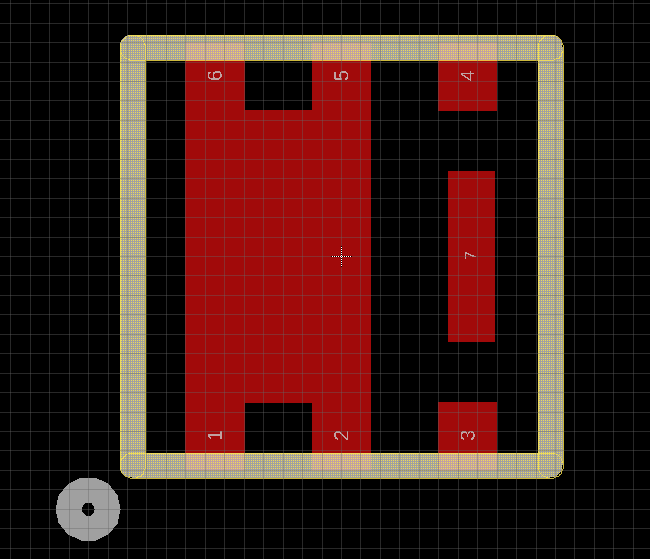
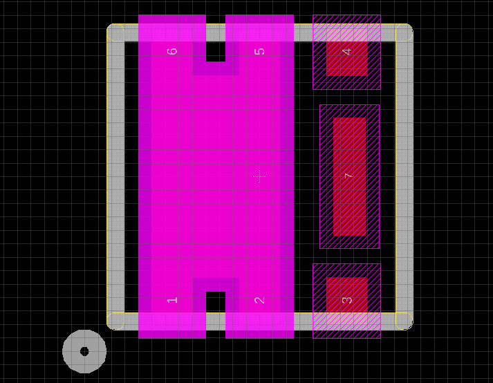

# EAGLE-Polygon-expander
[WIP] This is a python script that will take a Polygon command and thicken it by a specified amount. Useful for creating solder mask with 4 mil expansion for instance

## Usage
Let's say you want to draw the pad of the [SiA447DJ](https://www.vishay.com/docs/63774/sia447dj.pdf) and you came up with the folowing polygon: `Polygon 0 (-0.8 -1.1) (-0.8 1.1) (-0.5 1.1) (-0.5 0.75) (-0.15 0.75) (-0.15 1.1) (0.15 1.1) (0.15 -1.1) (-0.15 -1.1) (-0.15 -0.75) (-0.5 -0.75) (-0.5 -1.1) (-0.8 -1.1)`

Now you want to create the `tStop` polygon with 0.1016 mm (4 mil) clearance.

The new expanded polygon command should look like this: `Polygon 0 (-0.9016 -1.2016) (-0.9016 1.2016) (-0.3984 1.2016) (-0.3984 0.8516) (-0.2516 0.8516) (-0.2516 1.2016) (0.2516 1.2016) (0.2516 -1.2016) (-0.2516 -1.2016) (-0.2516 -0.8516) (-0.3984 -0.8516) (-0.3984 -1.2016) (-0.9016 -1.2016)`

But calculating this by hand is a nightmare so this little script can do this tidious task for me.

To use it simply give the script your Polygon command and the desired expansion (2 here):

`python expand.py "Polygon 0 (0 0) (0 1) (1 1) (1 0) (0 0)" "2"`

and the folowing output will be generated:
`Polygon 0 (-2.0 -2.0) (-2.0 3.0) (3.0 3.0) (3.0 -2.0) (-2.0 -2.0)`

You can now copy and paste this into the EAGLE command line